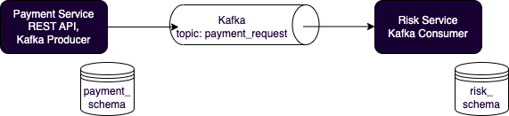
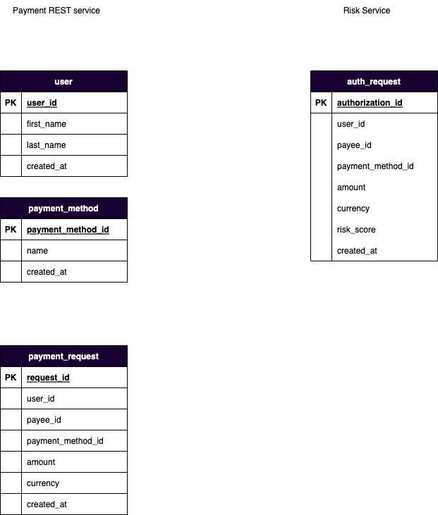

<!-- PAYMENT DEMO -->

# Getting Started

## Prerequisites
* Docker
* Postman (optional)

## Instructions

### Download the repository
  ```sh
  git clone git@github.com:ivry/payment_demo.git
  ```
  
### Build with Docker
```sh
  docker compose build
  docker compose up -d
  ```

### Check that all containers are running
```sh
% docker ps

CONTAINER ID   IMAGE                             COMMAND                  CREATED        STATUS        PORTS                          NAMES
d4f70d9657ad   confluentinc/cp-kafka:7.0.1       "/etc/confluent/dock…"   32 hours ago   Up 32 hours   0.0.0.0:9092->9092/tcp         broker
687d30e36886   payment_demo-payment_app          "python3 payment_app…"   32 hours ago   Up 32 hours   0.0.0.0:8000->8000/tcp         payment_app
eb2315c81ef6   payment_demo-risk_app             "python3 risk_app.py"    32 hours ago   Up 32 hours   8000/tcp                       risk_app
bd78e331b560   confluentinc/cp-zookeeper:7.0.1   "/etc/confluent/dock…"   32 hours ago   Up 32 hours   2181/tcp, 2888/tcp, 3888/tcp   zookeeper
34232179f258   payment_demo-postgres_db          "docker-entrypoint.s…"   32 hours ago   Up 32 hours   0.0.0.0:1234->5432/tcp         postgres_db
```


### Create the Kafka Topic needed for this project
```sh
  docker exec -it broker kafka-topics --bootstrap-server localhost:9092  --topic payment_request --create
  ```

### Confirm that Kafka Topic was created
List topics should show ```payment_request```
```sh
% docker exec -it broker kafka-topics --bootstrap-server localhost:9092  --list

payment_request  
```

### Check that database tables were created. Open a Postgres client
```sh
docker exec -it postgres_db psql -d demo_db -U demo_user
```

Once logged on, run the following commands to check that schemas and tables were created

```sh
demo_db=# \dn
          List of schemas
      Name      |       Owner       
----------------+-------------------
 payment_schema | demo_user
 public         | pg_database_owner
 risk_schema    | demo_user
(3 rows)


demo_db=# SET search_path=risk_schema;
SET
demo_db=# \dt
               List of relations
   Schema    |     Name     | Type  |   Owner   
-------------+--------------+-------+-----------
 risk_schema | auth_request | table | demo_user
(1 row)


demo_db=# SET search_path=payment_schema;
SET
demo_db=# \dt
                  List of relations
     Schema     |      Name       | Type  |   Owner   
----------------+-----------------+-------+-----------
 payment_schema | payment_method  | table | demo_user
 payment_schema | payment_request | table | demo_user
 payment_schema | user            | table | demo_user
(3 rows)


```

# Test / Run  

## Creating payments, users and payment methods
If using Postman, import the file `./docs/payment_demo.postman_collection` into Postman.
The file contains four examples for creating a user / retrieving all users, creating a payment method / retrieving all payment methods and creating a payment / retrieving all payments

Note that to simplify the creation of payments, the app doesn't check that the `payment_method_id` and `user_id` provided actually exist.

## Check records added to database -- Risk Service
The Risk Service writes to a single table in `risk_schema`:
```sh
demo_db=# select * from risk_schema.auth_request;
           auth_request_id            |               user_id                |               payee_id               |          payment_method_id           |   amount   | currency | risk_score |          created_at           
--------------------------------------+--------------------------------------+--------------------------------------+--------------------------------------+------------+----------+------------+-------------------------------
 ad5f0e72-c982-4995-b675-fc606f08c9d9 | 996e3f78-d4b2-4cf8-b5b5-211e2b1092d4 | 42382de3-632c-4891-84b5-dc7be5bcacc5 | 7cda23ab-a898-43c3-bfc3-0c0258646313 | 300.000000 | USD      |         67 | 2022-11-12 01:14:52.714083+00
 3200cba8-b188-4941-bee6-0411bf3760bf | 6681afd1-ca07-4141-8110-e6b5562d2830 | 82a13262-0706-40b4-9637-6fbf3669a5c7 | 92f76bc8-9b97-4d32-a6f7-b312155d1b0a | 787.000000 | USD      |         44 | 2022-11-12 01:34:17.976965+00
 6a79e3a7-9b99-422d-83c3-8ec0b41c3e10 | cb2c677e-a19a-47bb-a4f0-5ab29bca645d | 2a4e5a74-2caa-47fc-93c7-e87f41f15f0f | 1be9d251-8888-4659-bd3e-7d119d578e53 | 245.000000 | USD      |         62 | 2022-11-12 01:34:18.728358+00
 76023ddc-69b0-4ddb-b283-c6cca33d8919 | e2c42c53-73a3-4d3b-8289-5d8feea1c2df | d6852bf3-eba2-424a-8688-a1c2009000ec | 0cef94cb-7504-4500-9329-9e761c30eded | 175.000000 | USD      |         81 | 2022-11-12 01:34:19.452703+00
 2619a011-83ee-41a3-ad0c-d46b56396b1d | e31ac9f7-35d5-4162-9a69-747aa417f3fa | 1a204580-e3e9-4cff-b15e-008200ac9f08 | 14c79fae-0b91-4c21-87d5-4271d729b630 | 626.000000 | USD      |          5 | 2022-11-12 01:34:20.2001+00
 08df812b-4bf5-4a1e-9065-e96cdbbd7553 | 17ad376c-d6a8-4533-860b-d4a5d0358e29 | 7d55b377-d6af-4d5b-9ab1-d3d833092f22 | c232552f-8e59-4764-b010-d521c0ea211b | 910.000000 | USD      |         78 | 2022-11-12 01:34:20.898162+00
 62a2d897-fb8b-4365-9d06-d1f14d4a818d | 9ba784e8-a0c1-4f45-a8c6-8580cfe2985d | a552d0f2-672f-4f7c-8f38-eb3e5ee889ba | 46876cda-9d94-4f9c-9edf-bedcf1b3a9e8 | 489.000000 | USD      |         25 | 2022-11-12 01:34:21.644713+00
 6825a7d9-9139-41f9-841b-045d3912341d | 2460efa8-a3a1-4dae-8136-b7a70fe66cad | e87cf3bd-5208-4cf9-abbf-8a1e57866232 | 0314fcf9-00d3-42ee-876f-7e371600679d | 474.000000 | USD      |         92 | 2022-11-12 01:34:22.37513+00
 310da392-f9a7-4a60-a40f-51c19f92b296 | 9c6eb990-cb84-4526-b3c5-a8ca55e56e41 | 18103cd8-584a-4cd0-bb48-e4b5b130f761 | 92ca44f5-e5e6-4796-a09c-ecd0394d7bb0 | 568.000000 | USD      |         18 | 2022-11-12 01:34:23.093675+00
 940810a2-af61-43ec-b2ef-f22f0c0bac02 | 5bc4d09e-6026-4c38-bfb8-74454b48634c | 87e2b90f-bdbc-4ab0-b398-2c0ad1c18c7a | aa647528-8635-4415-ad66-f1a1f7bffe6b | 385.000000 | USD      |         59 | 2022-11-12 01:34:23.827773+00
 5dae7ee3-a268-4048-8e44-4a4132ccabea | c528083e-32dc-45b6-8c1b-af11d6db39b7 | 859bc753-6c5e-44cf-a6d3-266d945a1fa7 | 3dc0f336-c4d1-4e6e-b006-3b43f321a736 | 351.000000 | USD      |         70 | 2022-11-12 01:34:24.559134+00
(11 rows)

demo_db=# 

```

# Notes

## Architecture

The project consists of two services: A Payment Service, which provides a REST API, and a Risk Service, which receives request to determine the risk associated with a payment. In this project the Risk Service is always invoked by the Payment Service.


[]()

## Data Model

The diagram below describes the data model for both services. On the left is the data model for the payment REST service, and on the right is the data model for the Risk service. In the current implementation each service has its own schema and both services share the same database instance.

[]()


# Contact
ivry.semel@gmail.com
