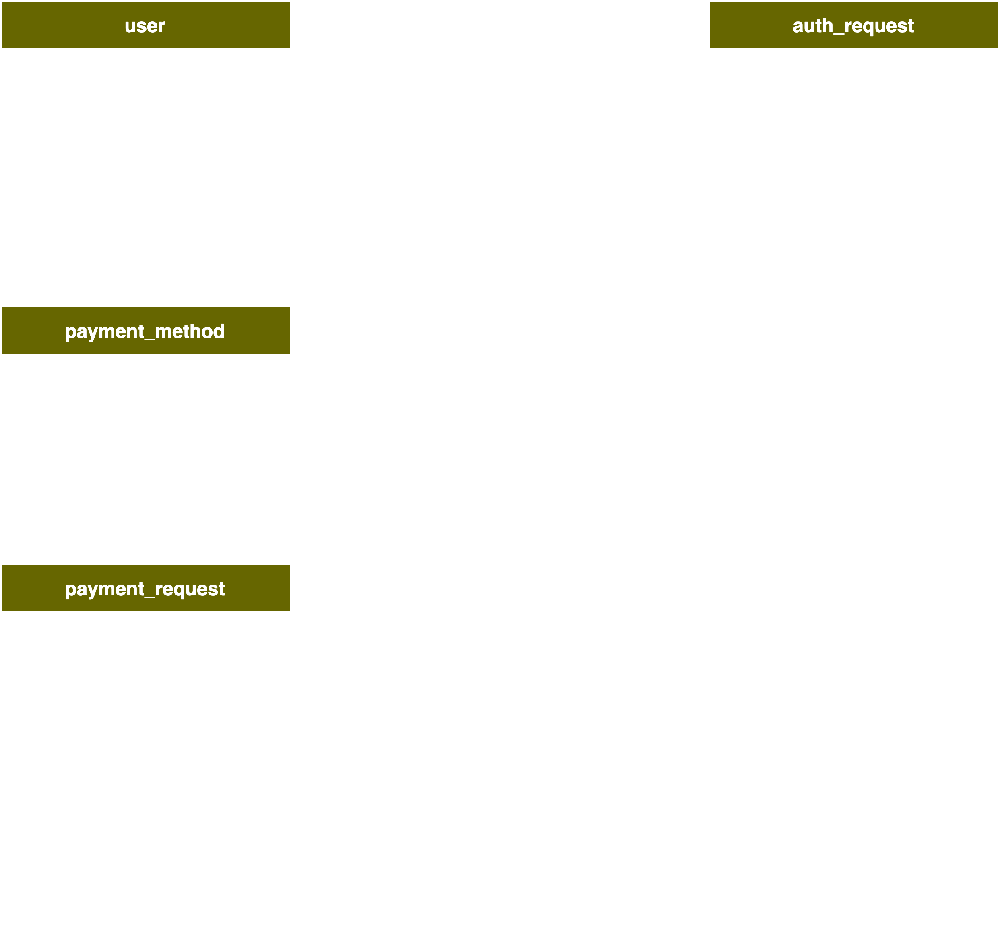

<!-- PAYMENT DEMO -->

##### Table of Contents  
- [Getting Started](#getting-started)
  * [Prerequisites](#prerequisites)
  * [Instructions](#instructions)
    + [Download the repository](#download-the-repository)
    + [Build with Docker](#build-with-docker)
    + [Check that all containers are running](#check-that-all-containers-are-running)
    + [Create the Kafka Topic needed for this project](#create-the-kafka-topic-needed-for-this-project)
    + [Confirm that Kafka Topic was created](#confirm-that-kafka-topic-was-created)
    + [Check that database tables were created. Open a Postgres client](#check-that-database-tables-were-created-open-a-postgres-client)
- [Run](#run)
  * [Create a user A](#create-a-user-a)
  * [Create a user B](#create-a-user-b)
  * [Create a payment method](#create-a-payment-method)
  * [Create a Payment (user A pays User B)](#create-a-payment--user-a-pays-user-b-)
  * [Retrieve users](#retrieve-users)
  * [Retrieve payment methods](#retrieve-payment-methods)
  * [Retrieve payments](#retrieve-payments)
    + [Note that there is no REST API to retrieve information from the risk service](#note-that-there-is-no-rest-api-to-retrieve-information-from-the-risk-service)
- [Examples](#examples)
- [Check Database](#check-database)
  * [Connect to Postgres](#connect-to-postgres)
  * [Payment Service](#payment-service)
    + [`user` table](#-user--table)
    + [`payment_method` table](#-payment-method--table)
    + [`payment_request` table](#-payment-request--table)
  * [Risk Service](#risk-service)
    + [`auth_request` table](#-auth-request--table)
- [API Endpoints](#api-endpoints)
    + [POST /users](#post--users)
    + [POST /payment_methods](#post--payment-methods)
    + [POST /payments](#post--payments)
- [Architecture and Data Model](#architecture-and-data-model)
  * [Architecture](#architecture)
  * [Data Model](#data-model)


# Getting Started

## Prerequisites
* Docker
* curl

## Instructions

### Download the repository
```sh
git clone git@github.com:ivry/payment_demo.git
```
  
### Build with Docker
```sh
docker compose build
```
```sh
docker compose up -d
```

### Check that all containers are running
```sh
% docker ps

CONTAINER ID   IMAGE                             COMMAND                  CREATED        STATUS        PORTS                          NAMES
d4f70d9657ad   confluentinc/cp-kafka:7.0.1       "/etc/confluent/dock…"   32 hours ago   Up 32 hours   0.0.0.0:9092->9092/tcp         broker
687d30e36886   payment_demo-payment_app          "python3 payment_app…"   32 hours ago   Up 32 hours   0.0.0.0:8000->8000/tcp         payment_app
eb2315c81ef6   payment_demo-risk_app             "python3 risk_app.py"    32 hours ago   Up 32 hours   8000/tcp                       risk_app
bd78e331b560   confluentinc/cp-zookeeper:7.0.1   "/etc/confluent/dock…"   32 hours ago   Up 32 hours   2181/tcp, 2888/tcp, 3888/tcp   zookeeper
34232179f258   payment_demo-postgres_db          "docker-entrypoint.s…"   32 hours ago   Up 32 hours   0.0.0.0:1234->5432/tcp         postgres_db
```


### Create the Kafka Topic needed for this project
```sh
docker exec -it broker kafka-topics --bootstrap-server localhost:9092  --topic payment_request --create
```

### Confirm that Kafka Topic was created
List topics should show ```payment_request```
```sh
docker exec -it broker kafka-topics --bootstrap-server localhost:9092  --list
```
```sh
payment_request  
```

### Check that database tables were created. Open a Postgres client
```sh
docker exec -it postgres_db psql -d demo_db -U demo_user
```

Once logged on, run the following commands to check that schemas and tables were created

```sh
\dn
```
```sh
          List of schemas
      Name      |       Owner       
----------------+-------------------
 payment_schema | demo_user
 public         | pg_database_owner
 risk_schema    | demo_user
(3 rows)
```

```sh
SET search_path=risk_schema;
```
```sh
SET
demo_db=# \dt
               List of relations
   Schema    |     Name     | Type  |   Owner   
-------------+--------------+-------+-----------
 risk_schema | auth_request | table | demo_user
(1 row)

```
```sh
SET search_path=payment_schema;
SET
demo_db=# \dt
                  List of relations
     Schema     |      Name       | Type  |   Owner   
----------------+-----------------+-------+-----------
 payment_schema | payment_method  | table | demo_user
 payment_schema | payment_request | table | demo_user
 payment_schema | user            | table | demo_user
(3 rows)

```

# Run  

## Create a user A
A user can be created with or without a `user_id`. If `user_id` is not provided then a random UUID will be generated.
```sh
curl -X POST localhost:8000/users -H 'Content-Type: application/json' -d '{"user_id":"f9944e44-0683-4d1d-9ac4-b0c973d21cad", "first_name":"Vita","last_name":"Fay"}'
```

## Create a user B
```sh
curl -X POST localhost:8000/users -H 'Content-Type: application/json' -d '{"user_id":"bf6538e6-700c-491a-807b-90fa620e5f03", "first_name":"Leonardo","last_name":"Kreiger"}'
```

## Create a payment method
```sh
curl -X POST localhost:8000/payment_methods -H 'Content-Type: application/json' -d '{"payment_method_id":"d4482132-5285-4dd6-83db-422ea50e9489", "name": "debit_card"}'
```

## Create a Payment (user A pays User B)
```sh
curl -X POST localhost:8000/payments -H 'Content-Type: application/json' -d '{"payment_request_id":"e3190de3-1791-4260-9f19-e5761602aaa7", "user_id": "f9944e44-0683-4d1d-9ac4-b0c973d21cad", "payee_id": "bf6538e6-700c-491a-807b-90fa620e5f03", "payment_method_id": "d4482132-5285-4dd6-83db-422ea50e9489", "amount": "6.00", "currency": "USD"}'
```

## Retrieve users
```sh
curl localhost:8000/users | json_pp
```
```sh
  % Total    % Received % Xferd  Average Speed   Time    Time     Time  Current
                                 Dload  Upload   Total   Spent    Left  Speed
100   283  100   283    0     0  16014      0 --:--:-- --:--:-- --:--:-- 23583
[
   {
      "created_at" : "2022-11-13T02:18:06.228625+00:00",
      "first_name" : "Vita",
      "last_name" : "Fay",
      "user_id" : "f9944e44-0683-4d1d-9ac4-b0c973d21cad"
   },
   {
      "created_at" : "2022-11-13T02:18:09.796295+00:00",
      "first_name" : "Leonardo",
      "last_name" : "Kreiger",
      "user_id" : "bf6538e6-700c-491a-807b-90fa620e5f03"
   }
]

```

## Retrieve payment methods
```sh
curl localhost:8000/payment_methods | json_pp
```
```sh
  % Total    % Received % Xferd  Average Speed   Time    Time     Time  Current
                                 Dload  Upload   Total   Spent    Left  Speed
100   130  100   130    0     0   7546      0 --:--:-- --:--:-- --:--:-- 10833
[
   {
      "created_at" : "2022-11-13T02:18:17.650276+00:00",
      "name" : "debit_card",
      "payment_method_id" : "d4482132-5285-4dd6-83db-422ea50e9489"
   }
]

```

## Retrieve payments
```sh
curl localhost:8000/payments | json_pp 
```
```sh
  % Total    % Received % Xferd  Average Speed   Time    Time     Time  Current
                                 Dload  Upload   Total   Spent    Left  Speed
100   299  100   299    0     0  18155      0 --:--:-- --:--:-- --:--:-- 27181
[
   {
      "amount" : 6,
      "created_at" : "2022-11-13T02:18:26.796974+00:00",
      "currency" : "USD",
      "payee_id" : "bf6538e6-700c-491a-807b-90fa620e5f03",
      "payment_method_id" : "d4482132-5285-4dd6-83db-422ea50e9489",
      "payment_request_id" : "e3190de3-1791-4260-9f19-e5761602aaa7",
      "user_id" : "f9944e44-0683-4d1d-9ac4-b0c973d21cad"
   }
]

```

### Note that there is no REST API to retrieve information from the risk service

# Examples
Examples have been provided in `./docs/add_users.sh`, `./docs/add_payment_methods.sh`, `./docs/create_payments.sh`

# Check Database

## Connect to Postgres
```sh
docker exec -it postgres_db psql -d demo_db -U demo_user 
```

## Payment Service
### `user` table
```sh
select * from payment_schema.user;
```
```sh
               user_id                | first_name | last_name |          created_at           
--------------------------------------+------------+-----------+-------------------------------
 f9944e44-0683-4d1d-9ac4-b0c973d21cad | Vita       | Fay       | 2022-11-13 01:57:17.998883+00
 bf6538e6-700c-491a-807b-90fa620e5f03 | Leonardo   | Kreiger   | 2022-11-13 01:57:25.677207+00
(2 rows)

```

### `payment_method` table
```sh
select * from payment_schema.payment_method;
```
```sh
          payment_method_id           |    name    |          created_at           
--------------------------------------+------------+-------------------------------
 d4482132-5285-4dd6-83db-422ea50e9489 | debit_card | 2022-11-13 01:57:32.150367+00
(1 row)

```

### `payment_request` table
```sh
select * from payment_schema.payment_request;
```
```sh
          payment_request_id          |               user_id                |               payee_id               |          payment_method_id           |  amount  | currency |          created_at           
--------------------------------------+--------------------------------------+--------------------------------------+--------------------------------------+----------+----------+-------------------------------
 e3190de3-1791-4260-9f19-e5761602aaa7 | f9944e44-0683-4d1d-9ac4-b0c973d21cad | bf6538e6-700c-491a-807b-90fa620e5f03 | d4482132-5285-4dd6-83db-422ea50e9489 | 6.000000 | USD      | 2022-11-13 01:57:40.575617+00
(1 row)

```

## Risk Service

### `auth_request` table
```sh
select * from risk_schema.auth_request;
```
```sh
           auth_request_id            |               user_id                |               payee_id               |          payment_method_id           |  amount  | currency | risk_score |          created_at          
--------------------------------------+--------------------------------------+--------------------------------------+--------------------------------------+----------+----------+------------+------------------------------
 e3190de3-1791-4260-9f19-e5761602aaa7 | f9944e44-0683-4d1d-9ac4-b0c973d21cad | bf6538e6-700c-491a-807b-90fa620e5f03 | d4482132-5285-4dd6-83db-422ea50e9489 | 6.000000 | USD      |         33 | 2022-11-13 01:57:40.73892+00
(1 row)

```

# API Endpoints
| HTTP Verbs | Endpoints            | Action                             |
|------------|----------------------|------------------------------------|
| POST       | /users               | Create a new user                  |
| GET        | /users               | Get a list of all users            |
| POST       | /payment_methods     | Create a new payment method        |
| GET        | /payment_methods     | Get a list of all payment method   |
| POST       | /payments            | Create a new P2P payment request   |
| GET        | /payments            | Get a list of all payment requests |


### POST /users
- Create a new user
- if user_id is not provided then it will be created by the service
```python
{
  user_id: Optional[UUID]
  first_name: string
  last_name: string
}
```

### POST /payment_methods
- Create a new payment method
- if payment_method_id is not provided then it will be created by the service
```json
{
  payment_method_id: Optional[UUID]
  name: string
}
```

### POST /payments
- Create a new payment request
- if payment_id is not provided then it will be created by the service
- payee_id and user_id must be valid users
- payment_method_id must be a valid payment method
```json
{
    payment_request_id: Optional[UUID]
    user_id: UUID
    payee_id: UUID
    payment_method_id: UUID
    amount: Decimal
    currency: string
}
```

# Architecture and Data Model

## Architecture

The project consists of two services: A Payment Service, which provides a REST API, and a Risk Service, which receives request to determine the risk associated with a payment. In this project the Risk Service is always invoked by the Payment Service.


[]()

## Data Model

The diagram below describes the data model for both services. On the left is the data model for the payment REST service, and on the right is the data model for the Risk service. In the current implementation each service has its own schema and both services share the same database instance.

[]()


# Contact
ivry.semel@gmail.com
